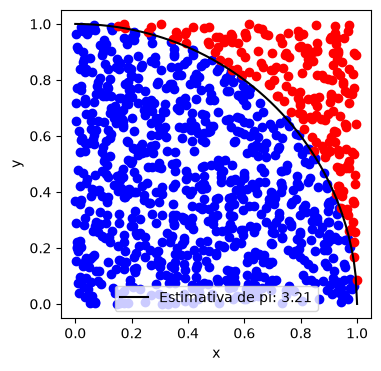
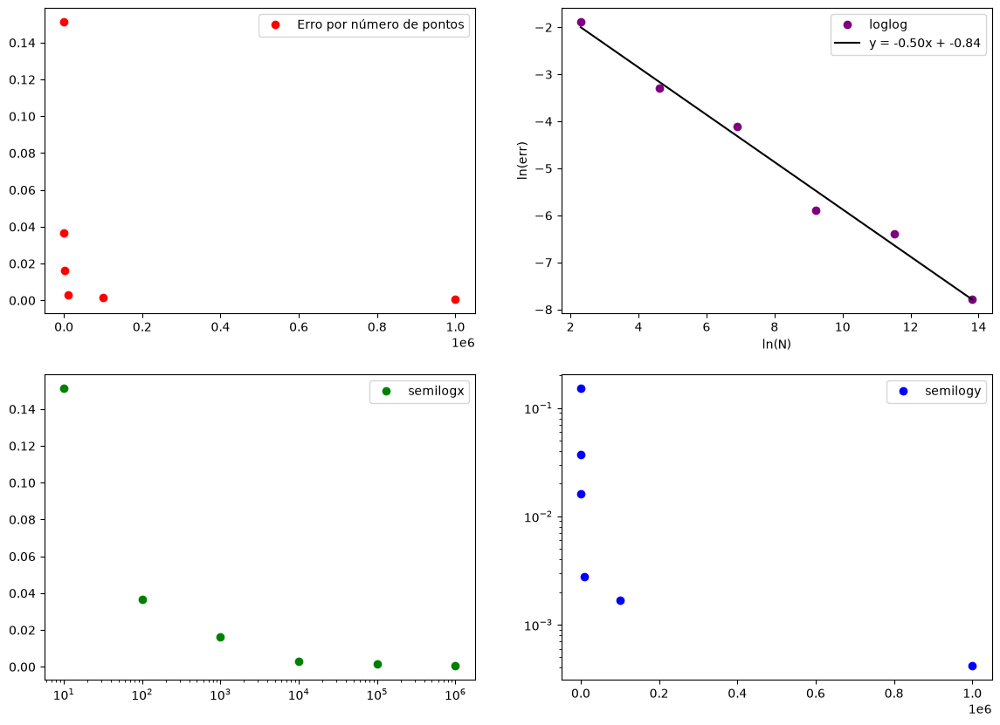
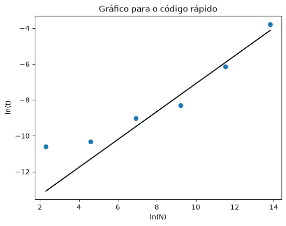
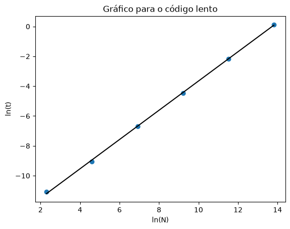

--- PROJETO 1 ---
O primeiro projeto da disciplina consiste em usar o método de Monte Carlo para aproximar o valor de pi com precisão arbitrária, 
comparando as propriedades de alguns códigos diferentes, como tempo de execução, como o erro escala com o número de entradas, 
e uma visualização gráfica do processo de sorteio de pontos.

Após utilizar sorteios aleatórios para calcular o valor de pi por meio da probabilidade de um par ordenado aleatório se encontrar dentro de um
círculo de raio 1, foi possível obter a seguinte figura como visualização desse processo

  

aqui são usadas $N = 1000$ pontos espalhados para estimar o valor de pi no código "lento" com laços e estruturas de decisão. O próximo objetivo é implementar uma versão "rápida" do código utilizando vetorização via NumPy e eliminar as estruturas decisórias com lógica Booleana. Feito isso, é possível identificar de que maneira o erro relativo ao valor de pi implementado no NumPy escala com o número de pontos usado para a estimativa, resultando nos painéis a seguir

  

  

Observamos que a escala "loglog" é a a única que exibe comportameto linear, assim é possível concluir que o erro escala com N numa lei de
potência que pode ser determinada pela equação da reta do fit feito, uma vez que temos um coeficiente angular igual a $-0.5$, é fácil observar que o erro cai com o inverso da raiz quadrada do número de pontos, $\ln(Erro) = -0.5\ln(N) - 0.84$, o que implica que $Erro(N) \approx 0.4 \frac{1}{\sqrt{N}}$ é a lei de potência de fato.

Por fim, o gráfico do tempo de erro também revela informações relevantes acerca do algoritmo empregado (o erro aqui é o erro médio sob 10 iterações). Para o código rápido obtemos

  

  

aqui, na escala logarítmica vemos que não há aumento considerável no tempo de execução até a ordem $N \sim 10^3$, depois o tempo de execução explode rápido. A lei de potência na tendência dos quatro últimos pontos é, aproximadamente $t \sim N^{0.8}$ 

  

Em contraste ao primeiro cenário, o código lenta apresenta explosão rápida do tempo médio de execução, que faz o código rápido dominar a zona 
$N > 10^2$, antes disso não há ganho de tempo considerável. A lei de potência do conjunto completos de pontos aqui é linear $t \sim N$.

